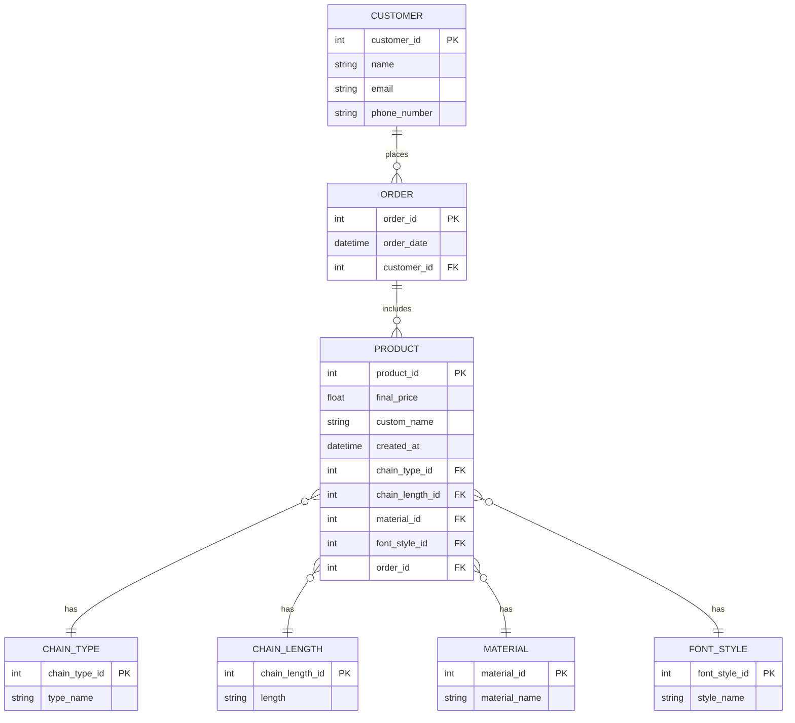

# **GISH** 
### (Glamorous, Innovative, Stylish, and Hip)

### **Personalized Name Necklace Order Platform**

---

### **Description**  
A web application that allows users to design customizable name necklaces, place orders, and track delivery dates. It integrates user management, an intuitive ordering process, and admin functionality to manage orders and suppliers.

---

### **Features and Functionalities**  

#### **Core Features**

1. **User Management**
   - Registration and login with email verification.
   - Update personal and contact details (e.g., phone number, address).
   - Password recovery via email.

2. **Necklace Customization and Ordering**
   - Design customizable necklaces with:
     - **Name Input**: Users can enter a name.
     - **Font Style Selection**: Dropdown for different font options.
     - **Material Selection**: Options for materials like gold, silver, and rose gold.
     - **Chain Type and Length**: Dropdown to select chain type and length.
   - Real-time preview of the designed necklace using JavaScript.
   - Add to cart and checkout system with:
     - Order summary page.
     - Delivery address input.

3. **Order Tracking**
   - Display estimated delivery dates based on supplier availability.
   - Order status tracking: `Pending`, `In Production`, `Shipped`, `Delivered`.

4. **Admin Panel**
   - Manage products (materials, fonts, and chains).
   - View and update order statuses.
   - Manage suppliers and delivery timelines.

5. **Inbox Functionality**
   - Allow users to send inquiries to admins (e.g., order issues or delivery questions).
   - Admin can reply to messages via the portal.

6. **Responsive UI**
   - A clean and user-friendly interface:
     - Navbar with links to "Home," "Shop," "My Orders," and "Contact Us."
     - Bootstrap-powered responsive design for mobile and desktop.
     - Collapsible sidebars for order history.

---

### **Implementation Details**  

#### **Phase 1: Setting up the Django Environment**
- Initialize the Django project and PostgreSQL database.
- Install dependencies like `django-bootstrap4`, `django-crispy-forms`, and `django-allauth` for authentication.

#### **Phase 2: Database Schema Design**
Define models for:
1. **Users**: Extend `AbstractUser` to include additional fields like `address` and `phone_number`.
2. **Products**:
   - `Material`: e.g., Gold, Silver.
   - `FontStyle`: e.g., Arial, Script.
   - `ChainType`: e.g., Cable, Figaro.
3. **Orders**:
   - `User`: ForeignKey to associate the order with a user.
   - `NecklaceDetails`: JSON field to store customization details (e.g., name, font, material).
   - `Status`: Order status.
   - `SupplierDeliveryDate`: Expected delivery date.
4. **Messages**:
   - `Sender`, `Receiver`, `Content`, and `IsArchived`.

#### **Phase 3: Backend Functionalities**
- **User Authentication**:
  - Register/login/logout using Django’s built-in views.
  - Role-based permissions: `User` for customers, `Admin` for product management.
- **Order Handling**:
  - CRUD operations for orders.
  - Automatically calculate delivery dates based on the supplier’s schedule.
- **Admin Panel**:
  - Use Django’s admin site to manage orders and update statuses.

#### **Phase 4: Frontend with Bootstrap and JavaScript**
1. **Templates**:
   - **`base.html`**: Contains reusable elements like headers and footers.
   - **Order Page**:
     - Form to customize necklaces.
     - JavaScript for a live preview of user inputs (e.g., name in selected font).
   - **My Orders**:
     - List of user orders with statuses and delivery dates.
2. **Bootstrap Enhancements**:
   - Use modals for viewing order details.
   - Grid layout for product options.
3. **JavaScript Functionalities**:
   - Live form validation.
   - Preview necklace design dynamically.

#### **Phase 5: Testing and Security**
- Test for:
  - Validation of user input (e.g., valid name and email).
  - Responsiveness across devices.
  - Role-based access control for admin and users.
- Implement security measures:
  - Hash passwords with Django’s default hashing.
  - Use HTTPS for data transmission.

#### **Phase 6: Deployment**
- Deploy on **Render**, **Heroku**, or **PythonAnywhere**.
- Ensure DNS setup and HTTPS are configured.

---

### **Bonus Features for Creativity**

1. **Dynamic Pricing**:
   - Calculate prices dynamically based on material, chain type, and length.
   - Display discounts for bulk orders or festive sales.

2. **Payment Integration**:
   - Integrate Stripe/PayPal for secure online payments.

3. **Order Notifications**:
   - Send order confirmation and shipping updates via email.
   - Real-time order status updates with WebSocket/Django Channels.

4. **User Reviews and Ratings**:
   - Allow users to review products and rate their experience.

5. **Third-Party Integration**:
   - Use FedEx or UPS API to provide real-time delivery tracking.

6. **Dark Mode Toggle**:
   - Implement a dark mode for better UX.

---

# **ERDiagram**




### **Week 1: Project Setup and Database Design**

#### **Goals:**
- Set up the project environment.
- Create database schema and initial models.
- Establish a clear workflow for development.

#### **Tasks:**
1. **Project Setup:**
   - Install required software: Python, PostgreSQL, Django.
   - Create a new Django project and app:
     ```bash
     django-admin startproject gish
     python manage.py startapp orders
     ```
   - Configure the PostgreSQL database in `settings.py`.

2. **Environment Setup:**
   - Set up a virtual environment using `venv`.
   - Install dependencies like `django-bootstrap4`, `django-crispy-forms`, and `django-allauth`.

3. **Database Schema:**
   - Plan models for `User`, `Order`, `Product` (e.g., materials, fonts, chain types).
   - Write models in `models.py` and make initial migrations:
     ```bash
     python manage.py makemigrations
     python manage.py migrate
     ```

4. **User Authentication:**
   - Integrate Django’s built-in authentication.
   - Customize the `User` model using `AbstractUser` to add fields like `address` and `phone`.

5. **Testing the Setup:**
   - Run the development server to ensure the environment is working:
     ```bash
     python manage.py runserver
     ```

---

### **Week 2: Backend Development**

#### **Goals:**
- Build backend logic for the application.
- Implement user authentication and order management.

#### **Tasks:**
1. **User Authentication:**
   - Implement registration, login, and logout views using Django’s built-in authentication system.
   - Add email-based password recovery.

2. **CRUD for Products:**
   - Create views for adding and managing:
     - Materials (Gold, Silver).
     - Font styles (Script, Arial).
     - Chain types (Cable, Figaro).
   - Use Django’s admin interface for quick product management.

3. **Order Management:**
   - Implement the `Order` model with:
     - Fields: `user`, `necklace_details`, `status`, `delivery_date`.
   - Create backend views to:
     - Place orders.
     - Update order statuses.
     - Calculate estimated delivery dates based on supplier data.

4. **Testing Backend Functionalities:**
   - Use Django’s test framework to write unit tests for models and views.

---

### **Week 3: Frontend Development**

#### **Goals:**
- Design the user interface with Bootstrap.
- Add interactivity using JavaScript.

#### **Tasks:**
1. **Bootstrap-Driven Templates:**
   - Create reusable templates:
     - `base.html`: Header, footer, and navigation.
     - `home.html`: Landing page with an overview of the service.
     - `order_form.html`: Form for customizing necklaces.

2. **Order Customization Form:**
   - Create a form with:
     - Input fields for name, font style, material, chain type, and chain length.
     - JavaScript for live preview of the necklace design.

3. **Order Tracking:**
   - Design a page to list all user orders with statuses (e.g., `Pending`, `In Production`).

4. **Responsive Design:**
   - Ensure the app is mobile-friendly with Bootstrap’s grid system.
   - Add collapsible sidebars for order history and profile management.

5. **JavaScript Enhancements:**
   - Add real-time validation for forms.
   - Use libraries like `jQuery` or vanilla JavaScript to handle dynamic content (e.g., live preview of necklace).

---

### **Week 4: Testing, Deployment, and Final Touches**

#### **Goals:**
- Test the application thoroughly.
- Deploy the project and polish the UI/UX.

#### **Tasks:**
1. **Testing:**
   - Test each feature for functionality:
     - User registration, login, and password recovery.
     - Order placement and status updates.
     - Live preview and form validation.
   - Perform security testing:
     - Ensure data is encrypted (e.g., hashed passwords).
     - Test role-based access restrictions.

2. **Polish the UI:**
   - Add visual appeal with hover effects, modals, and consistent spacing.
   - Ensure color contrast and font readability.

3. **Deployment:**
   - Deploy the app using **Render**, **Heroku**, or **PythonAnywhere**.
   - Set up PostgreSQL in the production environment.
   - Use HTTPS for secure connections.

4. **Documentation:**
   - Write a brief user guide for the app.
   - Document the code structure, making it easy for future maintenance.

5. **Extra Features (Optional):**
   - Integrate a payment gateway like Stripe for real orders.
   - Use a library like Chart.js to display order statistics on the admin dashboard.

---

### **Deliverables by the End of the Month**

1. A fully functional Django web application with:
   - User authentication and order management.
   - Responsive design using Bootstrap.
   - JavaScript-driven necklace customization.
2. A live hosted URL for the app.
3. Source code documented and uploaded to GitHub.
4. Optional enhancements like payment integration or live delivery tracking.

---
